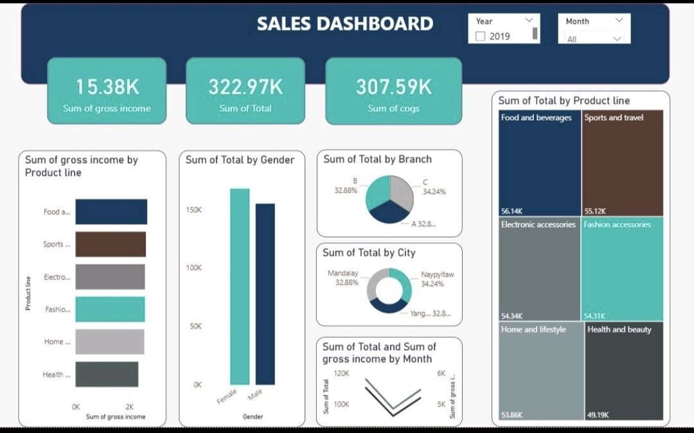

# 🛒 Supermarket Sales Analysis & Interactive Dashboard

## 📌 Overview
An end-to-end data analytics project exploring supermarket sales performance across various branches, product lines, and customer demographics. This project features an interactive dashboard designed to monitor key financial KPIs, analyze customer purchasing behavior, and evaluate product profitability to support data-driven decision-making.

---

## 📊 Key Metrics & Financial Highlights
* **Total Sales Revenue:** `$322.97K`
* **Cost of Goods Sold (COGS):** `$307.59K`
* **Total Gross Income:** `$15.38K`
* **Gross Margin Rate:** `4.76%`

---

## 🔍 Key Insights & Visualizations

* **Product Line Breakdown:**
  * **Food & Beverages** and **Sports & Travel** lead overall sales and gross income generation.
  * Balanced performance across **Electronic accessories**, **Fashion accessories**, **Home & lifestyle**, and **Health & beauty**.
* **Branch & Regional Performance:**
  * Sales are evenly distributed across all three operational hubs:
    * **Branch C (Naypyitaw):** `34.24%` of total sales
    * **Branch B (Mandalay):** `32.88%` of total sales
    * **Branch A (Yangon):** `32.88%` of total sales
* **Customer Demographics:**
  * Higher purchasing volume observed among female shoppers compared to male shoppers.
* **Monthly Trends & Seasonality:**
  * Monitored fluctuations in sales revenue and gross margin over time to identify peak buying periods.

---

## 📁 Dataset Details
The dataset comprises **1,000 transaction records** with key features including:
* **Invoice ID:** Unique transaction identifier.
* **Branch & City:** Branch location (`Yangon`, `Naypyitaw`, `Mandalay`).
* **Customer Type & Gender:** Membership status (`Member` vs. `Normal`) and gender breakdown.
* **Product Line:** Product categories (6 distinct lines).
* **Financial Details:** Unit price, quantity, 5% tax, total revenue, COGS, and gross income.
* **Payment Method:** Payment type (`Ewallet`, `Cash`, `Credit card`).
* **Rating:** Customer satisfaction score (scale 1–10).

🔗 **Dataset Source:** You can view and download the raw dataset directly from [Supermarket Sales Dataset](https://github.com/ManarAbdeen/Sales-Dashboard/blob/main/supermarket_sales%20-%20Sheet1%20(1).csv).

---

## 🛠️ Tools & Technologies
* **Power BI / Microsoft Excel:** Interactive dashboard design, visualizations, and slicers.
* **Data Modeling & Calculations:** DAX / Excel formulas for gross profit calculation and dynamic aggregation.
* **Data Wrangling:** Data cleaning, attribute transformation, and formatting.

---
